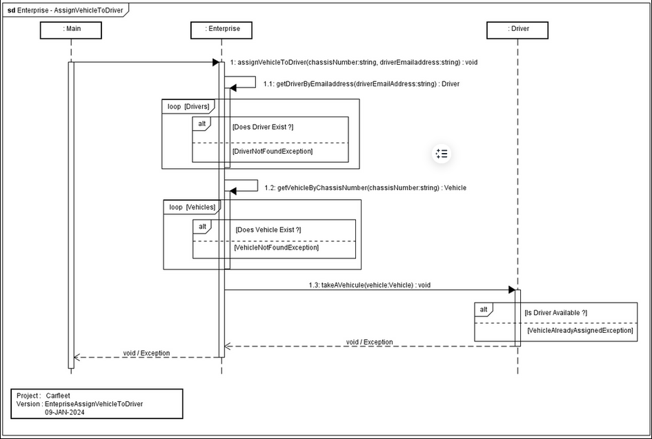

# SequenceToCode

Ce dépôt a été publié à des fins pédagogiques.

## Intention pédagogique

Dans la continuité du chapitre précédent (Class Diagram), il vous est demandé dans ce laboratoire de déduire le digramme de classes en partant de l'observation d'une séquence existante.
La question à laquelle répondre en réalisant votre architecture est "Quelle est l'architecture minimale nécessaire pour que la séquence soit réalisable ?"

## Objectifs opérationnels

Chaque technicien atteindra les objectifs suivants en réalisant ce laboratoire:

- [ ] Analyser un diagramme de séquence afin de se familiariser à la norme imposée.
- [ ] Dessiner l'architecture (diagramme de classe) minimale pour pouvoir réaliser la séquence.
- [ ] Coder, dans le langage de son choix, la séquence.
- [ ] Revisiter les notions de "git-flow" et de "conventional commit" en appliquant les pratiques aussi bien 
    * lors de la création du diagramme de classe (plant uml ou autre outil de "uml as code")
    * lors de l'écriture du code
- [ ] Réalisez un fork de ce dépôt.
- [ ] Appliquer la structure suivante à votre dépôt:

  ```
  <yourProject>
  ├───docs
  └───src
  .gitignore
  README.md
  ```

## Point de départ

* Voici le diagramme de séquence à étudier:



* Les informations complémentaires à prendre en compte:
   - [ ] La classe Driver:
      * hérite de la classe Person.
   - [ ] La classe Person:
      * est identifiée grâce à une adresse email.
   - [ ] La classe Vehicle:
     * est identifiée grâce à son numéro de chassis.

## Livraison

* Le livrable final est présent sur une branche de type [release](https://www.atlassian.com/git/tutorials/comparing-workflows/gitflow-workflow) au sens gitflow (et non github).
* Les commits respectent les bonnes pratiques du [conventional commit](https://www.conventionalcommits.org/en/v1.0.0/).
* Une issue est adressée à votre enseignant (adresse email du cpnv) et contient le commit à étudier.
